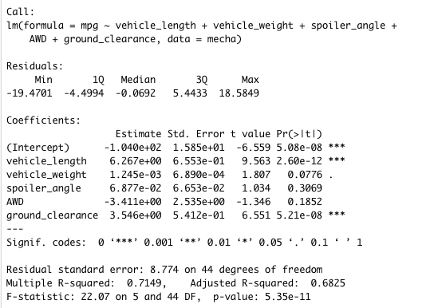
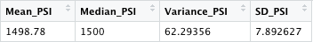
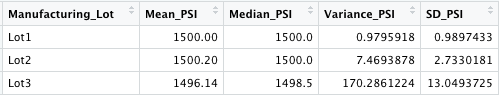
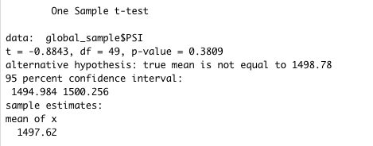
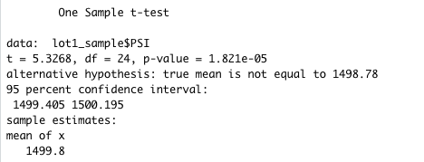
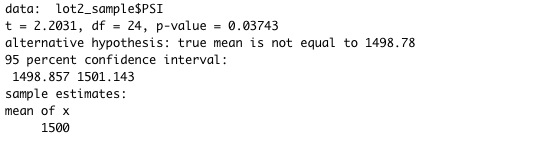
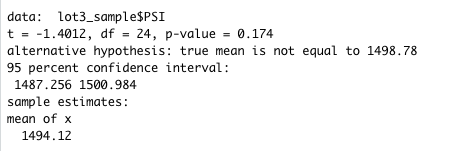

# MechaCar_Statistical_Analysis

## Project Overview

Using linear regression and statistical testing, we are aiming to analyze a series of data from the automotive industry to determine the most impactful variables for a MechaCar prototype.

## Linear Regression to Predict MPG

In the summary about, we are looking at the values in the Pr(>|t|) column to find our p-values that determine the statistical significance of each vehicle specification. As a result, we can see that vehicle length and ground clearance are the more significant contibutors to MPG, given their p-values provide a non-random variance due to their p-values < an alpha of 0.05.

The r-squared of this regression model is 0.71 (rounded), which tells us that 71% of the variations in MPG can be attributed to changes in vehicle length, vehicle weight, spoiler angle, drivetrain and ground clearance. As a result, we can conclude that this linear model is an effective predictor of MPG in MechaCar prototypes.

## Summary Statistics on Suspension Coils

Total Manufacturing Lot Summary

Summary by Manufacturing Lot

From the above images, we can see that globally, the variance across all lots was 62.3 psi, which is within the design specification that states that the suspension coil variance may not exceed 100 psi. However, when we isolate each lot individually, we see that Lot 3 has a significant variance of over 170, which is well outside of said design specification of <100 psi variance. Lot 1 and 2 are well within range at variances of 0.98 and 7.50, respectively.

## T-Tests on Suspension Coils

### Across All Lots

Here, we performed a t-test across all manufacturing lots in an attempt to reject our null hypothesis that there is no significant statistical difference between the PSI across all lots and the population mean. The test across all lots was 0.069, which is above our significant threshold of 0.05, which does not provide enough evidence for us to reject the null hypothesis.

### Lot 1

Similarly, when we ran a t-test for just samples from Lot 1, we get a p value fan less than the significance level of 0.05, which allows us to reject the null hypothesis and conclude that the PSI from Lot 1 is statistically different from the population mean.

### Lot 2

Like we did for Lot 1, we also ran a t-test for samples from Lot 2 and arrived at a p-value of 0.083 (see image above). This is larger than our significance level of 0.05 and thus we cannot reject our null hypothesis from this data alone.

### Lot 3

Similarly, when a t-test was run for just samples across Lot 3, we see a p-value result of 0.28 (rounded, from image above). Like Lot 2, we do not have enough evidence to reject our null hypothesis.

## Study Design: MechaCar vs Competition

In order to perform a statistical analysis and compare the performance of a MechaCar prototype against competitor vehicles, we would like to consider a few additional metrics:
- Cost
- Safety Rating
- Fuel Efficiency (City)
- Fuel Efficiency (Highway)
- Horse Power
- Torque

In this study, our null hypothesis would be as follows:
- The mean value of each metric is not statistically different between the MechaCar prototype and the competitor model.

To peform our study, we would need the data for both the MechCar prototype and the competitor vehicle in a dataframe with each metric in its own column. We could perform statistical summaries and t-tests to determine the differences between the prototype and competitors and attempt to reject the null hyppthesis for each metric we aim to test. We could also use a One-Way ANOVA test to compare the means of numerical variables across each metric.
